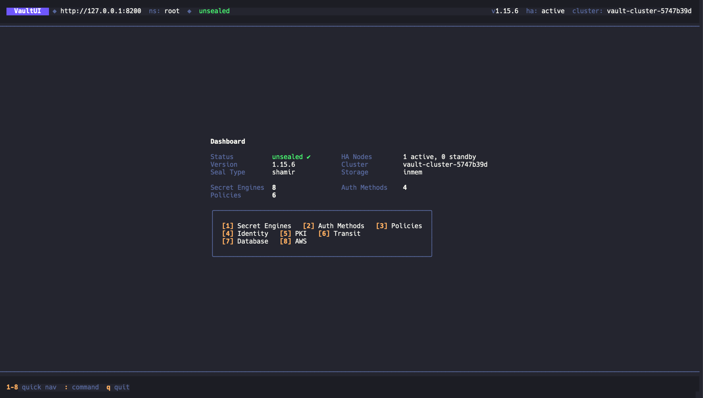

# VaultUI

A **k9s-inspired terminal UI** for [HashiCorp Vault](https://www.vaultproject.io/).
Browse secrets, auth methods, and more — without leaving your terminal.

<p align="center">
  
</p>

## Features

- **Dashboard** — seal status, version, HA node count, storage backend, resource counts
- **Secret Engines browser** — list all KV, PKI, Transit, and other mounts
- **Path browser** — drill into KV v2 directories and read secrets
- **Secret detail view** — key-value table with copy-to-clipboard
- **Auth Methods browser** — list all enabled auth methods
- **Command palette** — type `:secrets`, `:auth`, `:dash`, `:q`
- **Vim-style navigation** — `j`/`k`, `g`/`G`, `Ctrl+D`/`Ctrl+U`, `Enter`, `Esc`
- **Stack-based routing** — every view preserves scroll position and state

## Quick Start

### Prerequisites

- Go 1.21+
- A running Vault instance (or use the bundled dev setup below)

### Install

```bash
go install github.com/miladbeigi/vaultui@latest
```

Or build from source:

```bash
git clone https://github.com/miladbeigi/vaultui.git
cd vaultui
go build -o vaultui .
```

### Run

```bash
# Uses VAULT_ADDR and VAULT_TOKEN from environment
vaultui

# Or pass flags explicitly
vaultui --vault-addr https://vault.example.com --token s.xxxxx

# With a namespace (Enterprise)
vaultui --namespace admin
```

### Local Dev Environment

Spin up a local Vault with seeded test data:

```bash
docker compose up -d
export VAULT_ADDR=http://127.0.0.1:8200
export VAULT_TOKEN=root
vaultui
```

## Keybindings

| Key | Action |
|-----|--------|
| `j` / `↓` | Move down |
| `k` / `↑` | Move up |
| `Enter` | Open / drill in |
| `Esc` | Go back |
| `g` / `Home` | Jump to top |
| `G` / `End` | Jump to bottom |
| `Ctrl+D` | Page down |
| `Ctrl+U` | Page up |
| `1` | Secret Engines |
| `2` | Auth Methods |
| `:` | Command palette |
| `c` | Copy selected value |
| `C` | Copy secret as JSON |
| `q` | Quit |

## Command Palette

Press `:` to open, then type a command:

| Command | Action |
|---------|--------|
| `:secrets` | Go to Secret Engines |
| `:auth` | Go to Auth Methods |
| `:dash` | Go to Dashboard |
| `:q` / `:quit` | Quit |

## Configuration

VaultUI reads configuration from multiple sources (in priority order):

1. CLI flags (`--vault-addr`, `--token`, `--namespace`)
2. Environment variables (`VAULT_ADDR`, `VAULT_TOKEN`, `VAULT_NAMESPACE`)
3. Config file (`~/.vaultui.yaml`)
4. Token file (`~/.vault-token`)

## Tech Stack

| Layer | Choice |
|-------|--------|
| Language | [Go](https://go.dev) |
| TUI Framework | [Bubble Tea](https://github.com/charmbracelet/bubbletea) |
| Styling | [Lipgloss](https://github.com/charmbracelet/lipgloss) |
| Vault Client | [vault/api](https://pkg.go.dev/github.com/hashicorp/vault/api) |
| CLI | [Cobra](https://github.com/spf13/cobra) + [Viper](https://github.com/spf13/viper) |

## Project Structure

```
├── cmd/                    # CLI entrypoint (Cobra)
├── internal/
│   ├── app/                # Main Bubble Tea model, router, keybindings
│   ├── clipboard/          # Cross-platform clipboard utility
│   ├── ui/
│   │   ├── components/     # Reusable table component
│   │   ├── styles/         # Lipgloss theme and color palette
│   │   └── views/          # Dashboard, engines, path browser, detail, auth
│   └── vault/              # Vault API client wrapper
├── docs/
│   └── DESIGN.md           # Detailed design document and roadmap
└── docker-compose.yml      # Local Vault dev environment with seed data
```

## License

MIT
